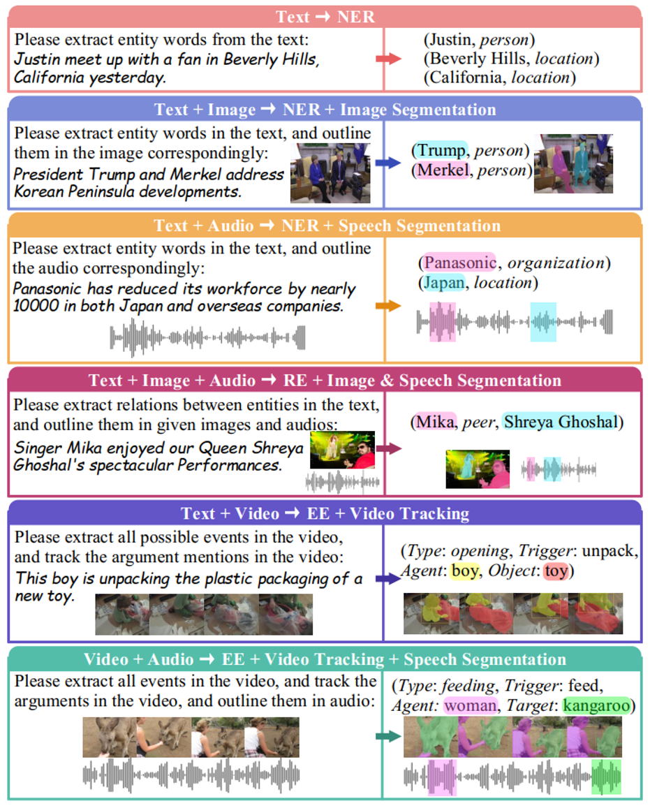

<h1 align="center">
Recognizing Everything from All Modalities at Once: Grounded Multimodal Universal Information Extraction
</h1>

**ACL (Findings) 2024**

[Meishan Zhang](https://zhangmeishan.github.io/), [Hao Fei](http://haofei.vip/)*, [Bin Wang]()
, [Shengqiong Wu](https://chocowu.github.io/), [Yixin Cao](https://sites.google.com/view/yixin-homepage), [Fei Li](https://scholar.google.com/citations?user=AoMmysMAAAAJ&hl=zh-CN), [Min Zhang](https://zhangmin-nlp-ai.github.io/)
(*Correspondence )

 

----------

## Note: The data part of this project currently has not been released yet, as we are working on significantly expanding the dataset in terms of both quantity and annotation content.

## Please stay tuned; the updated data will be released soon.

----------

## MUIE Benchmark Data

  

To evaluate the performance of our grounded MUIE system, we develop a benchmark testing set. We select 9 existing datasets from different modalities (or combinations thereof) for IE/MIE tasks. The following table summarizes these datasets of the raw sources. We then process these datasets, such as Text↔Speech, to create 6 new datasets under new multimodal (combination) scenarios. Before annotation, we carefully select 200 instances from their corresponding testing sets, ensuring each instance contained as much IE information as possible.
